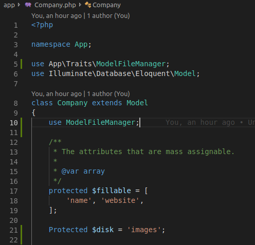

======================================================
Trait para el Manejo de Archivos asociados a modelos.
======================================================

Proposito
----------

Con este trait se puede manejar: almacenamiento, descarga, actualizacion y eliminacion de archivos asociados a un modelo.
Independientemente del nombre del campo, del tipo de archivo o del modelo que se quiera asociar, ademas almacena en el log de laravel errores descriptivos que pudiera ocurrir para su facil solucion.

Al momento de almacenar el archivo en disco este puede provenir tanto de un formulario (un request en general) como de datos binarios (file_get_content),

Primeros Pasos
---------------

- Colocar dentro de **app/Traits/** el archivo ModelFileManager.php
- Importar el trait al inicio del archivo del **Modelo** y luego utilizarlo al inicio de la **Clase**.
- Crear una variable protegida llamada $disk con el valor del disco creado para almacenar la info (en caso de no tener disco
  si no que se realiza en el root o disk base, dejar en blanco o no crear) **Protected $disk = 'images';**

Utilizacion
------------

Almacenar un archivo.
#####################
Para almacenar un archivo se utiliza la funcion **storeTheFile()** la cual acepta por parametro 3 valores:

- **$type** el cual acepta **put**, para indicar contenido proveniendo de un get or file_get_content y **store** para indicar contenido
  proveniente de un request.
- **$field** el cual contendra el nombre del campo en el modelo a asociar.
- **$file** que contendra el contenido del archivo en caso de no provenir desde un request.

Ejemplo: 
Almacenar un archivo en el campo logo del modelo Company, el cual llega por request:

::

    public function update(StoreCompany $request, Company $company)
    {
        $company->update($request->input());
        if ($request->hasFile('logo')) {
            $company->storeTheFile('store','logo');
        }
        return redirect()->route('companies.index')->with('message', trans("msg.company_update"))->with('message_type', 'success');
    }

Nota, la funcion se encargara de verificar si el campo tiene algun valor, en caso de tenerlo borrara el archivo original y
procedera a almacenar el nuevo.

Eliminar un archivo.
#####################
Para eliminar un archivo se utiliza la funcion **deleteTheFile()** la cual acepta solo un parametro:
- **$field** para indicar el campo de el modelo a asociar.

Ejemplo:
Borrar un archivo en el campo logo del modelo Company.

$company = Company::find($id);

**$company->deleteTheFile('logo');**

TODO:
-----

- Cambiar niveles de visibilidad de las funciones.
- Validacion para comprobar si el archivo no esta corrupto o esta en el request.